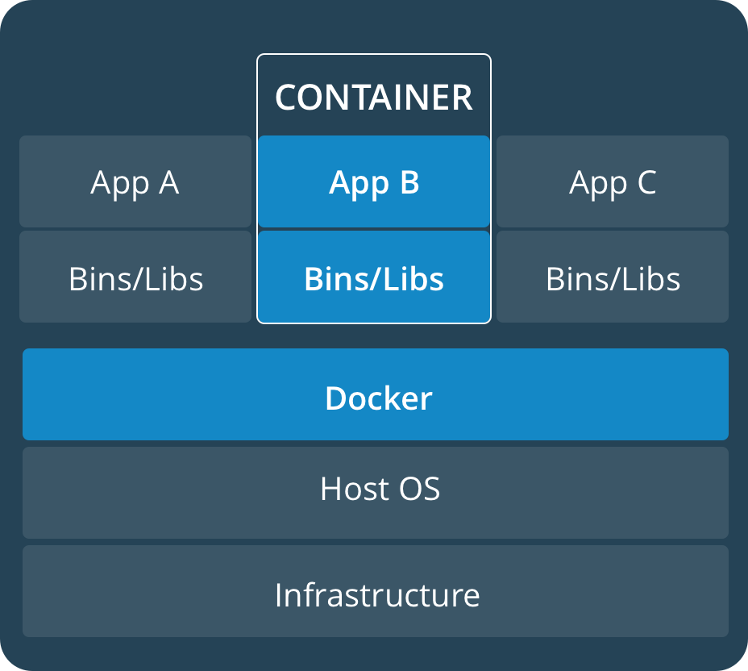
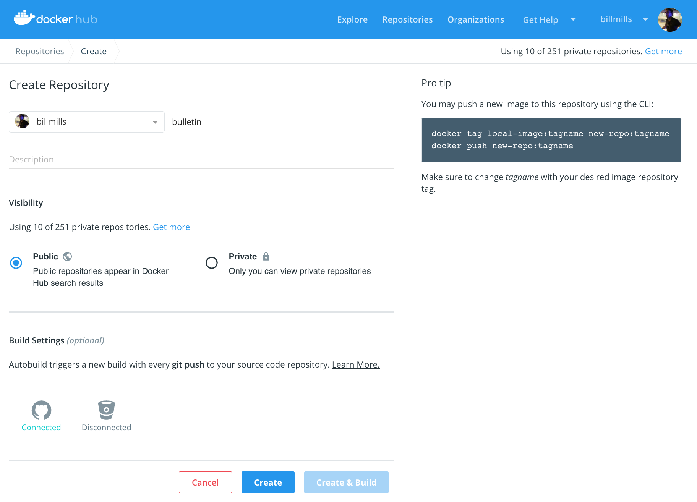

# 第一部分：安装

欢迎！ 我们很高兴您想学习`Docker`。 `Docker`快速入门培训模块教您如何：

1. 设置您的`Docker`环境（在此页面上）

2. 生成并运行镜像

3. 在`Docker Hub`上共享镜像

## Docker概念
`Docker`是供开发人员和系统管理员使用容器构建，运行和共享应用程序的平台。使用容器部署应用程序称为容器化。容器并不是新事物，但用于轻松部署应用程序的容器却是新事物。

容器化越来越受欢迎，因为容器是：

- 灵活：即使最复杂的应用程序也可以容器化。
- 轻量级：容器利用并共享了主机内核，在系统资源方面比虚拟机更加有效。
- 可移植：您可以在本地构建，部署到云并在任何地方运行。
- 松散耦合：容器是高度自给自足并封装的容器，使您可以在不破坏其他容器的情况下更换或升级它们。
- 可扩展：您可以在数据中心内增加并自动分布容器副本。
- 安全：容器将积极的约束和隔离应用于流程，而无需用户方面的任何配置。

### 镜像和容器
从根本上讲，一个容器不过是一个正在运行的进程，并对其应用了一些附加的封装功能，以使其与主机和其他容器隔离。容器隔离的最重要方面之一是每个容器都与自己的专用文件系统进行交互。该文件系统由`Docker`镜像提供。镜像包括运行应用程序所需的一切-代码或二进制文件，运行时，依赖项以及所需的任何其他文件系统对象。

### 容器和虚拟机

容器在`Linux`上本地运行，并与其他容器共享主机的内核。它运行一个离散进程，不占用任何其他可执行文件更多的内存，从而使其轻巧。

相比之下，虚拟机（`VM`）运行具有"虚拟机管理程序"对主机资源的虚拟访问权的成熟"来宾:操作系统。通常，`VM`会产生大量开销，超出了应用程序逻辑所消耗的开销。




## 设置自己的Docker环境
### 下载并安装Docker
`Docker Desktop`是适用于`Mac`或`Windows`环境的易于安装的应用程序，可让您在几分钟内开始编码和容器化。 `Docker Desktop`包含直接从您的机器构建，运行和共享容器化应用程序所需的一切。

按照适用于您的操作系统的说明下载并安装`Docker Desktop`：

[Mac](https://docs.docker.com/docker-for-mac/install/)
[Windows](https://docs.docker.com/docker-for-windows/install/)

### 测试Docker版本
成功安装`Docker Desktop`之后，打开终端并运行`docker --version`来检查计算机上安装的`Docker`的版本。
```shell
$ docker --version
Docker version 19.03.5, build 633a0ea
```

### 测试Docker安装
1. 通过运行`hello-world`镜像来测试`Docker`安装
```shell
    $ docker run hello-world

    Unable to find image 'hello-world:latest' locally
    latest: Pulling from library/hello-world
    ca4f61b1923c: Pull complete
    Digest: sha256:ca0eeb6fb05351dfc8759c20733c91def84cb8007aa89a5bf606bc8b315b9fc7
    Status: Downloaded newer image for hello-world:latest

    Hello from Docker!
    This message shows that your installation appears to be working correctly.
```

2. 运行`docker image ls`列出您下载到计算机上的`hello-world`镜像。

3. 列出显示消息后退出的`hello-world`容器（由镜像生成）。 如果它仍在运行，则不需要--all选项：
```shell
运行docker image ls列出您下载到计算机上的hello-world镜像。

列出显示消息后退出的hello-world容器（由镜像生成）。 如果它仍在运行，则不需要--all选项：
```

## 结论

至此，您已经在开发机器上安装了`Docker Desktop`，并进行了快速测试，以确保您已设置为构建和运行第一个容器化应用程序。


# 第二部分：构建并运行自己的镜像

## 前提条件
完成第1部分中的安装和设置。

## 简介
现在您已经设置了开发环境，借助`Docker Desktop`，您可以开始开发容器化的应用程序。通常，开发工作流程如下所示：

1. 首先创建`Docker`镜像，为应用程序的每个组件创建和测试单独的容器。
2. 将您的容器和支持基础结构组装成一个完整的应用程序。
3. 测试，共享和部署完整的容器化应用程序。

在本教程的此阶段，我们将重点放在此工作流程的第1步：创建容器基于的镜像。请记住，`Docker`镜像捕获了将在其中运行容器化进程的私有文件系统；您需要创建一个镜像，其中包含您的应用程序需要运行的内容。

> 一旦学习了如何构建镜像，容器化的开发环境就比传统的开发环境更容易建立，我们将在下面讨论。这是因为容器化的开发环境将隔离您的应用程序在`Docker`镜像中所需的所有依赖关系。除了在您的开发机器上安装`Docker`外，无需安装其他任何工具。这样，您可以轻松地为不同的堆栈开发应用程序，而无需在开发计算机上进行任何更改。

## 设置
让我们从[`Docker Samples`](https://github.com/dockersamples/node-bulletin-board)页面下载示例项目。

### `Git`

如果您使用的是`Git`，则可以从`GitHub`克隆示例项目：
```bash
git clone https://github.com/dockersamples/node-bulletin-board
cd node-bulletin-board/bulletin-board-app
```
该`node-bulletin-board`项目是一个简单的公告板应用程序，使用`Node.js`编写。在此示例中，假设您编写了此应用程序，现在正尝试对其进行容器化。

## 使用`Dockerfile`定义容器
查看`Dockerfile`公告板应用程序中调用的文件。Dockerfile描述了如何为容器组装专用文件系统，并且还可以包含一些元数据，这些元数据描述了如何基于该镜像运行容器。公告板应用程序`Dockerfile`如下所示：
```Dockerfile
# Use the official image as a parent image
FROM node:current-slim

# Set the working directory
WORKDIR /usr/src/app

# Copy the file from your host to your current location
COPY package.json .

# Run the command inside your image filesystem
RUN npm install

# Inform Docker that the container is listening on the specified port at runtime.
EXPOSE 8080

# Run the specified command within the container.
CMD [ "npm", "start" ]

# Copy the rest of your app's source code from your host to your image filesystem.
COPY . .
```
编写`Dockerfile`是容器化应用程序的第一步。您可以将这些`Dockerfile`命令视为有关如何构建镜像的逐步指南。此步骤采取以下步骤：

- 启动`FROM`先前存在的`node:current-slim`镜像。这是由`node.js`供应商构建的官方镜像，并已由D`ocker`验证为包含`Node.js`长期支持（`LTS`）解释器和基本依赖项的高质量镜像。
- 使用`WORKDIR`指定的后续操作应该从目录中取`/usr/src/app` 你的镜像文件系统（从不主机的文件系统）。
- `COPY``package.json`从您的主机到.镜像中当前位置（`.`）的文件（因此，是`/usr/src/app/package.json`）
- `RUN``npm install`镜像文件系统中的命令（将读取该命令`package.json`以确定应用程序的节点依赖性，并安装它们）
- `COPY` 在应用程序其余部分的源代码中，从主机到镜像文件系统。

您会看到，这些步骤与在主机上设置和安装应用程序所采取的步骤几乎相同。但是，将它们捕获为`Dockerfile`可以使您在可移植的隔离`Docker`镜像中执行相同的操作。

上面的步骤构建了我们镜像的文件系统，但是`Dockerfile`中还有其他几行。

该`CMD`指令是在镜像中指定一些元数据的第一个示例，该元数据描述了如何基于该镜像运行容器。在这种情况下，这意味着该镜像应支持的容器化过程为`npm start`。

该`EXPOSE 8080`指示`docker`，容器在运行时在端口8080上监听。

上面您看到的是组织一个简单的`Dockerfile`的好方法。始终以`FROM`命令开头，然后按照步骤构建专用文件系统，并以任何元数据规范作为结束。`Dockerfile指`令比上面看到的要多。有关完整列表，请参阅[`Dockerfile`参考](https://docs.docker.com/engine/reference/builder/)。

## 构建并测试您的镜像
现在您已经有了一些源代码和一个`Dockerfile`，现在该构建您的第一个镜像，并确保从其启动的容器能够按预期工作。

> `Windows`用户：此示例使用`Linux`容器。通过右键单击系统任务栏中的`Docker`徽标，然后单击“ 切换到`Linux`容器”（如果显示该选项），确保您的环境正在运行`Linux`容器。不用担心-本教程中的所有命令对于`Windows`容器的工作方式都完全相同。

`node-bulletin-board/bulletin-board-app`使用`cd`命令确保您位于终端或`PowerShell` 中的目录中。让我们构建您的公告板镜像：
```bash
docker image build -t bulletinboard:1.0 .
```
您将看到`Docke`r逐步完成`Dockerfile`中的每条指令，并逐步构建镜像。如果成功，则构建过程应以`message`结束`Successfully tagged bulletinboard:1.0`。

> `Windows`用户：在此步骤中，您可能会收到一条标题为“安全警告”的消息，其中指出了为添加到镜像中的文件设置的读取，写入和执行权限。在此示例中，我们不处理任何敏感信息，因此在此示例中，请不要理会警告。

## 将镜像作为容器运行
根据您的新镜像启动一个容器：
```bash
1. docker container run --publish 8000:8080 --detach --name bb bulletinboard:1.0
```
这里有几个常见的标志：

- `--publish`要求`Docker`将主机端口`8000`上传入的流量转发到容器的端口`8080`。容器具有自己的专用端口集，因此，如果要从网络访问某个端口，则必须以这种方式将流量转发到该端口。否则，作为默认的安全状态，防火墙规则将阻止所有网络流量到达您的容器。
- `--detach` 要求`Docker`在后台运行此容器。
- `--name`指定一个名称，您可以在后续命令中使用该名称来引用您的容器，在这种情况下为`bb`。

还要注意，您没有指定要运行容器的进程。您不必这样做，因为`CMD`在构建`Dockerfile`时使用了指令。因此，`Docker`知道`npm start`在容器启动时会自动运行该过程。

2. 在的浏览器中访问您的应用程序`localhost:8000`。您应该看到公告板应用程序已启动并正在运行。在这一步，您通常会尽一切可能确保容器按预期方式工作。例如，现在是运行单元测试的时候了。

3. 对公告板容器正常工作感到满意后，可以将其删除：
```bash
docker container rm --force bb
```
该`--force`选项将删除正在运行的容器。

## 结论
至此，您已经成功构建了镜像，对应用程序进行了简单的容器化，并确认您的应用程序已在其容器中成功运行。下一步将是在`Docker Hub`上共享您的镜像，以便可以轻松下载它们并在任何目标计算机上运行它们。

# 在`Docker Hub`上共享你的镜像

## 前提条件
在第2部分中，逐步完成构建镜像并将其作为容器化应用程序运行的步骤。

## 简介
至此，借助`Docker Desktop` ，您已经在本地开发机器的第2部分中构建了一个容器化应用程序。开发容器化应用程序的最后一步是在`Docker Hub`之类的仓库上共享您的镜像，以便可以轻松下载它们并在任何目标计算机上运行它们。

## 设置您的Docker Hub帐户
如果您还没有`Docker ID`，请按照以下步骤进行设置。这将允许您在`Docker Hub`上共享镜像。

1. 访问`Docker Hub`注册页面https://hub.docker.com/signup。

2. 填写表格并提交以创建您的`Docker ID`。

3. 验证您的电子邮件地址以完成注册过程。

4. 点击工具栏或系统托盘中的`Docker`图标，然后点击`登录/创建Docker ID`。

5. 填写新的`Docker ID`和密码。成功通过身份验证后，您的`Docker ID`将显示在`Docker Desktop`菜单中，代替您刚使用的“登录”选项。

> 您可以通过在命令行中输入来执行相同的操作`docker login`。

## 创建一个`Docker Hub`存储库并推送您的镜像
至此，您已经设置了`Docker Hub`帐户并将其连接到`Docker`桌面。现在，让我们进行第一个回购，并在那里共享公告栏应用程序。

1. 单击菜单栏中的`Docker`图标，然后导航至存储库>创建。您将被带到`Docker Hub`页面来创建一个新的存储库。

2. 将存储库名称填写为`bulletinboard`。现在暂时保留所有其他选项，然后单击底部的创建。



3. 现在您可以在`Docker Hub`上共享镜像了，但是您首先必须做的是：必须正确命名镜像的名称空间才能在`Docker Hub`上共享。具体来说，您必须将镜像命名为`<Docker ID>/<Repository Name>:<tag>。`您可以`bulletinboard:1.0`像这样重新标记镜像（当然，请替换`gordon`为您的`Docker ID`）：
```bash
docker image tag bulletinboard:1.0 gordon/bulletinboard:1.0
```

4. 最后，将镜像推送到`Docker Hub`：
```bash
docker image push gordon/bulletinboard:1.0
```
在`Docker Hub`中访问您的存储库，您将在此处看到新镜像。请记住，默认情况下，`Docker Hub`存储库是公共的。

> 推送有困难吗？请记住，您必须通过`Docker Desktop`或命令行登录`Docker Hub`，并且还必须按照上述步骤正确命名镜像。如果该推送似乎有效，但在`Docker Hub中`看不到该推送，请在几分钟后刷新浏览器，然后再次检查。

## 结论
现在，您的镜像已在`Docker Hub`上可用，您将可以在任何地方运行它。如果您尝试在尚未安装的新机器上使用它，则`Docker`将自动尝试从`Docker Hub`下载它。通过以这种方式移动镜像，您不再需要在要运行软件的机器上安装除`Docker`以外的任何依赖项。容器化应用程序的依赖项已完全封装并隔离在镜像中，您可以使用`Docker Hub`如上所述共享它们。

需要记住的另一件事：目前，您仅将镜像推送到D`ocker Hub`；那你的`Dockerfile`呢？一个关键的最佳实践是将它们保留在版本控制中，或者与应用程序的源代码一起保留。您可以在`Docker Hub`存储库描述中添加链接或注释，以指示可以在何处找到这些文件，不仅保留有关镜像构建方式以及作为完整应用程序运行的方式的记录。